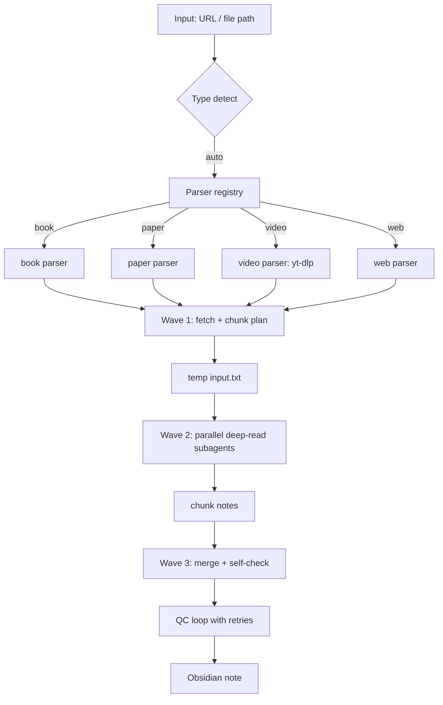

# deep-read-summarize

Deep reading & summarization workflow for **books, academic papers, videos, and web pages**, powered by DeepSeek Harness (DSH) subagents. Produces structured Obsidian-ready markdown notes with quality control.

> ⚠️ **Version compatibility (IMPORTANT)**: This project targets the **DSH workflow tool** (developer preview). See [Compatibility](#compatibility) below.

---

## ✨ Features

- 📚 **Books** (PDF/EPUB/MOBI) · 📄 **Papers** (arXiv/PDF/HTML) · 🎬 **Videos** (YouTube/Bilibili subtitles) · 🌐 **Web pages**
- 🔌 **Plugin parsers** — swap or extend input adapters without touching the core workflow
- 🧠 **MapReduce architecture** — long content is chunked and deep-read by parallel subagents, then merged
- 📐 **Structured output** — JSON Schema constraints on all sub-task results
- ✅ **Quality control loop** — citation grounding, schema validation, retry, optional cross-check
- ⏱️ **Failure discipline** — fatal config errors abort loudly; content failures degrade gracefully
- 🗂 **Obsidian-ready** — YAML frontmatter, consistent template, Dataview-friendly

---

## 🏗 Architecture



### Pipeline (3 waves)

| Wave | What | Agents |
|------|------|--------|
| 1 | Parser fetches content → writes temp file → builds chunk plan (JSON Schema validated) | 1 |
| 2 | Parallel subagents deep-read each chunk (Map) | N (chunks) |
| 3 | Merge into final note with embedded quality self-check (Reduce) + optional QC retry | 1-2 |

Total subagents: **N + 2~3** · Serial waves: **3**

---

## 🚀 Quick Start

### Prerequisites

- DeepSeek Harness (DSH) environment with the **workflow tool**
- Node.js ≥ 18 (for parsers/schemas)
- Optional: [yt-dlp](https://github.com/yt-dlp/yt-dlp) for video subtitles (`winget install yt-dlp.yt-dlp`)

### Usage

```jsonc
// workflow tool args
{
  "input": "https://arxiv.org/abs/2307.09042",   // URL or file path
  "type": "auto",                                 // auto | book | paper | video | web
  "options": {
    "minWords": 2500,          // minimum output length
    "fastMode": false,         // skip sections 5-7 for speed
    "maxChunks": 6,            // chunk cap (1-12)
    "requireCitations": true,  // require page/chapter for key citations
    "includeTimestamps": false // video timestamps (off by default)
  }
}
```

### Examples

| Input type | Example |
|------------|---------|
| Paper | `{"input": "https://arxiv.org/abs/2307.09042", "type": "paper"}` |
| Book | `{"input": "~/books/xxx.pdf", "type": "book"}` |
| Video | `{"input": "https://youtube.com/watch?v=xxx", "type": "video"}` |
| Web | `{"input": "https://example.com/article", "type": "web"}` |

### Output

Markdown note with YAML frontmatter, written to `D:/Obsidian 仓库/PensiveFei/精读笔记/<title>.md` (configurable via the `mdPath` logic in `workflow.js`).

---

## 🔌 Plugin Parsers

Each input type is a standalone parser in `parsers/`:

- `parsers/book.js` — PDF/EPUB/MOBI text extraction & chapter chunking
- `parsers/paper.js` — arXiv/PDF/HTML academic paper structure
- `parsers/video.js` — yt-dlp subtitle fetch + transcript cleanup
- `parsers/web.js` — generic page/article body extraction

**To customize**: drop your own parser into `custom-parsers/` with the same interface (`{ name, types, buildPrompt(input, opts) }`). Same-name types override built-ins. See `parsers/index.js` for the registry.

---

## 📐 Structured Output

All sub-task results are validated against JSON Schemas in `schemas/index.js`:

- `fetchResultSchema` — wave 1 chunk plan + metadata
- `chunkReadSchema` — per-chunk structured reading (keyPoints, concepts, citations)
- `qualityChecklistSchema` — QC gate fields

Invalid results trigger automatic retry. This makes downstream export (Markdown/Notion/database) reliable.

---

## ⏱ Failure Discipline

| Error class | Behavior |
|-------------|----------|
| **FATAL** (config: missing `input`, invalid `type`, bad `options`) | `throw` — workflow aborts loudly |
| **Degradable** (content fetch failure, chunk read failure) | `return { ok: false, stage, fatal: false }` — caller can decide |
| Chunk-level failures | Skipped + flagged as gaps in the final note |

---

## 💰 Cost Estimation

Typical token usage (paper, 6 chunks, full mode):

| Phase | Tokens (approx) |
|-------|-----------------|
| Wave 1 fetch + chunk | 2-5k (depends on source) |
| Wave 2 parallel reads | 6 × 1-2k |
| Wave 3 merge + QC | 3-5k |
| **Total** | **~15-25k tokens / paper** |

Use `fastMode: true` (skip sections 5-7) and lower `maxChunks` to reduce cost ~40%.

---

## 🔒 Security & Privacy

- Network fetching (video/web) is executed by subagents under DSH sandbox/approval policies — never run arbitrary scripts unattended
- File writes require appropriate permissions; the workflow returns content so the host agent can write if subagent lacks access
- **This repo contains no copyrighted content** — only workflow definitions, prompt templates, parser code, and schemas. All examples use public-domain or self-authored fixtures.

---

## ⚖️ Copyright

This project ships **only the pipeline** (code, prompts, schemas). It does **not** include extracted content from books, papers, or videos. Demo fixtures in `tests/fixtures/` are public-domain or self-authored. When you use this workflow on copyrighted material, the extracted summaries are your responsibility under applicable law.

---

## 🔧 Development

```bash
npm test          # fixture-driven tests
npm run lint      # syntax checks (node --check)
```

See `CONTRIBUTING.md` for contribution guidelines.

---

## Compatibility

> **DeepSeek Harness is a developer preview** and evolves rapidly with breaking changes.

- **Locked runtime**: DSH workflow tool semantics as of the commit in `package.json` / `CHANGELOG.md`
- **Known working**: `agent()`, `parallel()`, `phase()`, `log()`, `args` with JSON Schema subset (`type/properties/required/additionalProperties/items/enum/const/oneOf`)
- **Upgrade strategy**: pin your DSH version; re-validate with `npm test` after upgrading; breaking changes will be documented in `CHANGELOG.md`

---

## License

[MIT](LICENSE)

## Author

Your name here — contributions welcome!
